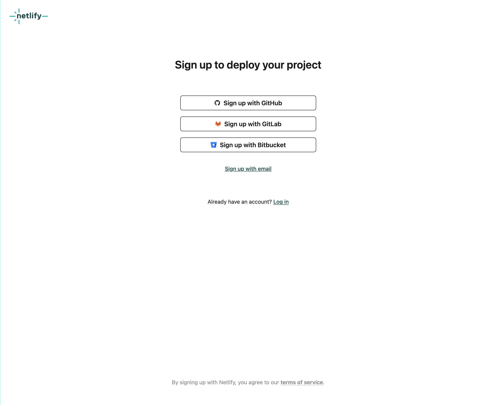
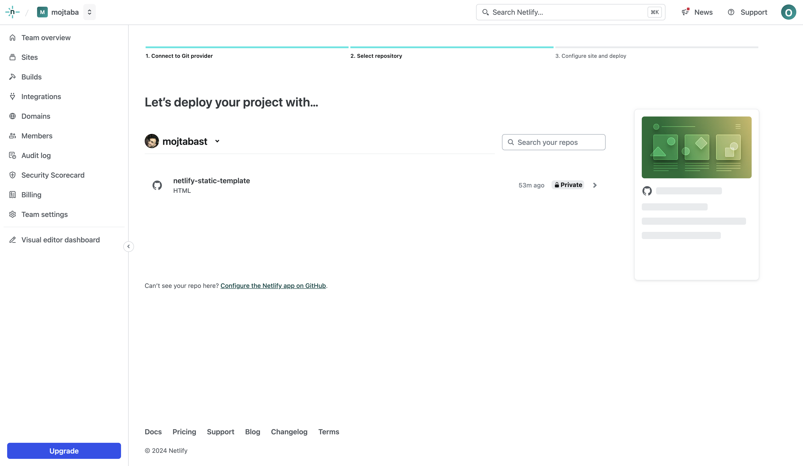
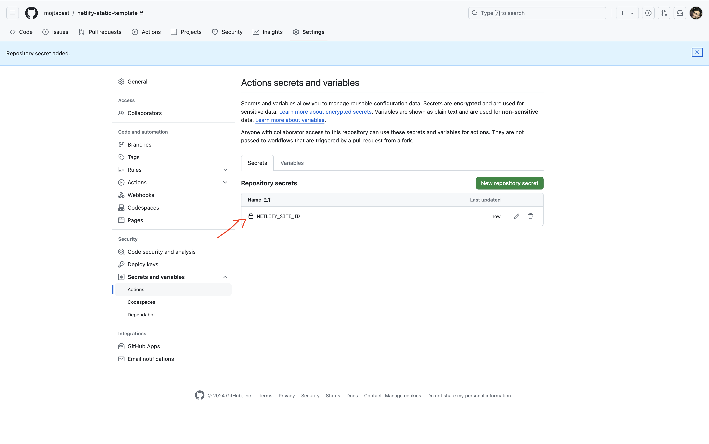
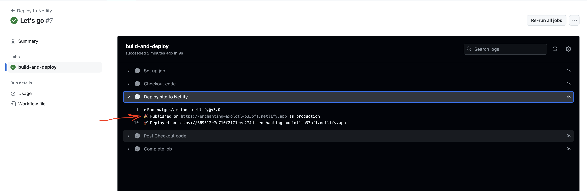

# Deploy static sites to netlify

با استفاده از این راهنما می‌تونید صفحات staticـتون رو دپلوی بکنید روی نتلیفای. منظور از استتیک همون صفحاتی هستش که با HTML,CSS و جاوااسکریپت می‌نویسید.

این تمپلیت برای بچه‌های دوره‌ی فرانت‌اندی که برگزار می‌کنم درست شده ولی اگه از منابع دیگه هم دارید یاد می‌گیرید٬ احتمالن بدردتون بخوره.

## فهرست

- [ساخت حساب نتلیفای](#%D8%B3%D8%A7%D8%AE%D8%AA-%D8%AD%D8%B3%D8%A7%D8%A8-%D9%86%D8%AA%D9%84%DB%8C%D9%81%D8%A7%DB%8C)
- [ساختار پروژه شما](#%D9%BE%D8%B1%D9%88%DA%98%D9%87-%D8%B4%D9%85%D8%A7)
- [اتصال ریپازیتوری گیت‌هاب به نتلیفای](#%D8%A7%D8%AA%D8%B5%D8%A7%D9%84-%D8%B1%DB%8C%D9%BE%D8%A7%D8%B2%DB%8C%D8%AA%D9%88%D8%B1%DB%8C-%DA%AF%DB%8C%D8%AA%D9%87%D8%A7%D8%A8-%D8%A8%D9%87-%D9%86%D8%AA%D9%84%DB%8C%D9%81%D8%A7%DB%8C)
- [مقادیر مورد نیاز گیت‌هاب از نتلیفای](#%D9%85%D9%82%D8%A7%D8%AF%DB%8C%D8%B1-%D9%85%D9%88%D8%B1%D8%AF-%D9%86%DB%8C%D8%A7%D8%B2-%DA%AF%DB%8C%D8%AA%D9%87%D8%A7%D8%A8-%D8%A7%D8%B2-%D9%86%D8%AA%D9%84%DB%8C%D9%81%D8%A7%DB%8C)
- [قرار دادن مقادیر در گیت‌هاب](#%D9%82%D8%B1%D8%A7%D8%B1-%D8%AF%D8%A7%D8%AF%D9%86-%D9%85%D9%82%D8%A7%D8%AF%DB%8C%D8%B1-%D8%AF%D8%B1-%DA%AF%DB%8C%D8%AA%D9%87%D8%A7%D8%A8)
- [تمام](#%D8%AA%D9%85%D8%A7%D9%85-)

## ساخت حساب نتلیفای

توی فدم اول شما نیاز به ساخت یک حساب (Account) روی سرویس نتلیفای دارید.

برای اینکار کافیه که وارد صفحه‌ی نام‌نویسی نتلیفای بشید.

https://app.netlify.com/signup

اینجا روش دلخواهتون رو می‌تونید انتخاب کنید. راحت‌ترینش اینه که همون اکانت گیت‌هابتون رو انتخاب کنید یعنی `Signup with Github` چون در هر صورت ما به حساب گیت‌هاب نیاز خواهیم داشت برای دپلوی کردن.

با ایمیل هم می‌تونید نام‌نویسی کنید که نوشته `Sign up with email`. من این مورد رو انتخاب می‌کنم چون از قبل با گیت‌هابم ساختم و می‌خوام یک حساب جدید درست کنم که روندش رو اینجا توضیح بدم. اگه این روش رو انتخاب کردید بعد از پر کردن فرمش یک ایمیل براتون فرستاده میشه که باید Verify کنید تا حسابتون ساخته باشه.

بعد از اینکه حسابتون ساخته میشه با یک همچین صفحه‌ای مواجه میشد:

که حالا چیزایی که می‌پرسه رو یک چیزی بزنید بره. مثلن می‌تونید به ترتیب اینارو انتخاب کنید: 

1. Personal
2. Personal Site
3. Freelancer

در پایان هم یک سوال این شکلی داره `What is the name of your team?` که اینجا هم باز به دلخواه می‌تونید هر چی خواستید بزنید. من معمولن اسم خودم رو می‌نویسم.

وقتی روی دکمه `Continue` میزنید. میرید به صفحه‌ی بعد:

اینجا می‌تونید یکی از ریپازیتوری‌هاتون رو برای شروع وصل کنید. ولی من توی قسمت بعدی می‌گم چجوری وصلش کنید. پس اینجا می‌تونید از `Skip this step for now.` استفاده کنید که زیر عنوان `Deploy your first project.` قرار گرفته.

خب دیگه اینجا حسابمون ساخته شده و وارد پیشخوان یا دشبورد حسابمون میشه. همچین چیزیه:

خب تا اینجا یکی از نیازمندی‌هامون برطرف شد. بریم سراغ قسمت بعدی.

## پروژه شما

شما در نهایت می‌خواید صفحه‌ی اچ‌تی‌ام‌التون (که همراه‌ش معمولن سی‌اس‌اس و جی‌اس هم دارید) رو یک جا قرار بدید که برای همه‌ی کاربرای اینترنت قابل دسترس باشه. یعنی یک لینکی وجود داشته باشه که هر کی بازش کرد بتونه دستپخت شما رو ببینه.

شما پروژه‌تون هر ساختاری که داره مهم نیست. ممکنه شما عکس‌هاتون رو توی پوشه‌ی `assets` نگه‌داری می‌کنید یا فایل‌های سی‌اس‌اس‌تون رو توی یک پوشه جداگونه گذاشتید. ایناش مهم نیست. کافیه که شما توی پروژه‌تون صرفن یک فایل `index.html` داشته باشید که توی `root` پروژه‌تون گذاشته باشید. یعنی توی پوشه‌ی پروژه‌تون باشه بدون اینکه توی پوشه‌های دیگه گذاشته باشیدش. نمونه‌ش رو روی همین ریپازیتوری دارید می‌بینید که کجاست.

جدای از پروژه‌تون ما می‌خوایم یک کاری کنیم که شما هر تغییری رو که به ریپازیتوری‌تون `push` می‌کنید٬ خودکار آخرین تغییراتون روی نتلیفای قرار بگیره.

برای اینکار گیت‌هاب خودش یک ویژگی داره به نام `Actions` که به شما اجازه میده وقتی روی ریپازیتوری تغییری ایجاد میشه به شکل خودکار یک سری کار بعدش تعریف کنید.

اینکار رو (Action) من انجام دادم و کافیه شما پوشه‌ی `.github` رو توی پروژه‌تون کپی کنید و بعدش کامیت کنید و پوش کنید.

یا اینکه اگه پروژه‌تون رو تازه می‌خواید شروع کنید می‌تونید همین ریپازیتوری من رو `Fork` کنید

بالای همین صفحه‌ی گیت‌هاب رو اگه نگاه کنید این قسمت میشه:

اگه خواستید `fork` کنید٬ می‌تونید همه‌ی فایل‌های دیگه مثل `readme` و پوشه‌ی `guide` رو بعدش پاک کنید چون بدردتون نمی‌خوره. همون `.github` رو باید نگه‌دارید.

## اتصال ریپازیتوری گیت‌هاب به نتلیفای

الان که ما هم حساب نتلیفای ساختیم و هم ریپازیتوریمون رو ساختیم و پوشه‌ی `.github` رو توش قرار دادیم. مرحله‌ی آخر اتصال این دوتا به همه.

### ساخت Site در نتلیفای

وارد [دشبورد نتلیفای](https://app.netlify.com/) بشید. بعدش باید یک `Site` جدید بسازید. هر ریپازیتوری‌تون یک `Site` باید براش ساخته بشه. یعنی بعدن اگه خواستید ریپازیتوری‌های دیگه‌تون رو هم به نتلیفای وصل کنید برای هر کدوم جداگونه یک سایت باید بسازید و همین مسیر رو دوباره برید.

توی دشبورد دکمه `Import from Git` رو بزنید. توی تصویر هم مشخص کردم:

بعدش وارد همچین صفحه‌ای می‌شید که باید گیت‌هاب رو انتخاب کنید:

از اینجا به بعد توی این فرآیند میفتید که به گیتهاب بگید که نتلیفای می‌تونه به ریپازیتوری‌هایی که روی گیت‌هاب دارید دسترسی داشته باشه. که دو مرحله داره.

البته مطمئن نیستم که برای شما هم دومرحله‌ای باشه یا نه. ولی اگه عضو یک سازمانی توی گیت‌هاب باشید احتمالن تصویر بعدی رو می‌بنید. اگه ندیدید هم فرق خاصی نداره و مشکلی نیست.

اینجا من روی نام‌کاربریم که `mojtabast` کلیک می‌کنم و می‌رم به مرحله‌ی دومی.

توی این مرحله باید به گیت‌هاب بگم که این دسترسی که می‌خوام به نتلیفای بدم چقدره. اگه `All Repositories` رو بزنید نتلیفای به همه‌ی ریپازیتوری‌هاتون می‌تونه دسترسی داشته باشه. اگه ریپازیتوری‌ای دارید که نباید نتلیفای بهش دسترسی داشته باشه٬ می‌تونید گزینه‌ی دوم که نوشته `Only select reopositories` رو انتخاب کنید. اینطوری فرض کنید ۱۰ تا اگه ریپازیتوری دارید٬ می‌تونید بگید که به فلان و فلان ریپازیتوری فقط دسترسی داشته باشه و دیگه به همه‌ی ریپازیتوری‌هاتون دسترسی نداره.

**نکته:** اگه روش دوم رو انخاب کنید و پروژه‌ی جدیدی رو بعدن بخواید وصل کنید٬ هی باید بیاید و پروژه‌‌ی جدید رو جداگونه دسترسی به نتلیفای بدید. 

در نهایت `Install` رو که بزنید نتلیفای می‌تونه ریپازیتوری‌های گیت‌هابتون رو ببینه از این به بعد.

بعد از این به این صفحه منتقل میشید:

اینجا باید ریپازیتوری‌ای که می‌خواید به این سایتی که روی نتلیفای ساختید وصل کنید رو انتخاب کنید.

اسم ریپازیتوری من `netlify-static-template` هست. که اون رو انتخاب می‌کنم و روش کلیک می‌کنم.

به یک صفحه دیگه منتقل میشم که این صفحه‌س:

**نکته:** من اسکرول کردم و اومدم ته صفحه.

توی این صفحه نیاز به تغییر خاصی نیست فقط خوبه که `Site Name` رو یک چیز معناداری بزنید چون توی لینک سایتتون استفاده میشه ازش. و در نهایت کافیه که به انتهای صفحه اسکرول کنید و دکمه‌ی `Deploy` رو بزنید.

خب تبریک می‌گم اولین سایت روی نتلیفای رو ساختیم و به یک ریپازیتوری گیت‌هابمون وصلش کردیم.

یک همچین صفحه‌ای مواجه می‌شیم:

شما به ازای هر سایتی که می‌سازید توی پنلش یک همچین صفحه‌ای براش دارید. فلش بالایی رو اگه دقت کنید می‌بینید که اسم سایت من (`enchanting-axolotl-b33bf1`) رو زده و فلش دومی که سمت چپ زدم (`Site Configuration`) هم تنظیمات سایت هستش که بعدتر میگم چه استفاده‌ای قراره ازش بکنیم.

## مقادیر مورد نیاز گیت‌هاب از نتلیفای

شما به دو تا مقدار `Site Id` و `Auth Token` نیاز دارید که گیت‌هاب بتونه بعد از هر تغییری که شما روی ریپازیتوریتون می‌دید٬ پروژه‌ی شما رو که وصلش کردید به `Site` در نتلیفای رو دپلوی کنه.

هر کدوم از این دو مقدار رو چجوری می‌تونید به دست بیارید رو من توضیح می‌دم. ولی این مقادیر رو شما برای سکشن بعدی نیاز دارید که توش توضیح می‌دم این مقادیر رو کجای گیت‌هاب باید برید بذارید.

### Site Id

سایت آی‌دی رو کافیه برید توی صفحه‌ی سایتی که توی نتلیفای ساختید و از ستون سمت چپ `Site Configuration` رو انتخاب کنید. توی سکشن قبلی اسکرین‌شات گذاشته بودم که چه شکلیه.

بعد که وارد صفحه‌ی `Site Configuration` با همچین چیزی روبرو میشید:

که همون جایی که مشخص کردم میشه رو در نهایت شما قراره کپی کنید.

### Auth Token

وارد [این صفحه](https://app.netlify.com/user/applications#personal-access-tokens) بشید. 

دکمه‌ی `New Access Token` رو بزنید. 

بعدش میرید توی این صفحه:

اینجا یک توضیحی به دلخواه بذارید که بعدن بفهمید برای چی این توکن رو ساختید. متنش میتونه هر چیزی باشه.

به `Expiration` هم دقت کنید که روی `No Expiration` گذاشتم. این توصیه‌ی امنیت خیلی خوبی نیست اگه چیزی رو دارید صرفن تست می‌کنید بهتره که مثلن ۷ روزه بذارید که خودش بعد از ۷ روز منقضی بشه و دیگه کار نکنه. ولی برای پروژه‌های خودتون که می‌خواید مدتها روش کار کنید اینکه بخواید هر چند وقت یک بار مجبور بشید برید هی عوضش کنید شاید خوشایند نباشه. 

در نهایت دکمه‌ی `Genrate Token` رو بزنید که توکن براتون ساخته شه.

به همچین صفحه‌ای منتفل میشید که توکن رو داره بهتون نشون میده:

این توکن (`nfp_...`) خیلی چیز مهمیه. حواستون باشه با هیچکسی به اشتراک نذاریدش. جایی خودتون هم ذخیره‌ش نکنید. هر کسی این توکن رو داشته باشه به کل حساب نتلیفای شما می‌تونه دسترسی داشته باشه. پس نه نگه‌ش دارید و نه به کسی بدیدش.

## قرار دادن مقادیر در گیت‌هاب

این مقادیری که توی سکشن قبلی توضیح دادم رو شما باید توی تنظیمات ریپازیتوری‌تون روی گیت‌هاب قرار بدید.

به ترتیب مراحل زیر رو می‌تونید برید.

بعد از اینکه روی `Settings` کلیک کردید. وارد صفحه‌ی تنظیمات ریپازیتوری می‌شید.

اینجا باید روی `Secrets and variables` کلیک کنید و بعد `Actions` رو انتخاب کنید. که بعدش وارد صفحه‌ی زیر میشد:

اینجا شما باید اون دو مقداری که مورد نیازه رو وارد کنید. اولین مقدار رو طبق مراحل زیر اضافه می‌کنیم. 

دکمه‌ی `New repository secrets` رو که بزنید به صفحه‌ی بعدی منتقل میشید:

اینجا شما می‌تونید مقادیر رو وارد کنید. هر مقداری دو بخش داره. یک بخشیش یک اسمی داره و یکیش هم مقداری هستش که برای اون اسم ست می‌کنید.

ما اینجا به دو تا مقدار به اسم‌های `NETLIFY_SITE_ID` و `NETLIFY_AUTH_TOKEN` نیاز داریم. مقادیرشون هم توی سکشن قبلی توضیح دادم که چجوری می‌تونید به دستش بیارید.
همونطور که توی اسکرین‌شات قبلی دیدید من `NETLIFY_SITE_ID` رو دارم اضافه می‌کنم.

بعد از اینکه فرم رو پر کردم. دکمه‌ی `Add secret` رو باید بزنم تا مقدارم به ریپازیتوری‌م اضافه بشه.

بعدش با این صفحه روبرو میشید:

**همین کار رو باید برای اضافه کردن `NETLIFY_AUTH_TOKEN` هم باید انجام بدید و مقدارش رو اضافه کنید.**

## تمام 🎉

بعد از اینکه مقادیر `NETLIFY_SITE_ID` و `NETLIFY_AUTH_TOKEN` به `Secrets` ریپازیتوری گیت‌هابتون اضافه کردید. از این به بعد هر کامیت و پوشی که می‌کنید٬ خودکار پروژه‌تون روی نتلیفای قرار می‌گیره و آخرین نسخه رو می‌بینید.

برای اینکه دپلوی‌هاتون رو ببینید می‌تونید برید به قسمت `Actions` توی ریپازیتوریتون.

هر باری که چیزی پوش می‌کنید یک بار خودکار اکشن رو اجرا می‌کنه و لیستش رو توی صفحه‌ی اکشنز می‌بینید:

اولین آیتمی که توی لیست می‌بینید آخرین چیزیه که اجرا شده. متن کامیت‌تون هم عنوانش میشه. که اینجا کامیت من `Let's go` بوده.

که اگه روش کلیک کنید٬ یک صفحه این شکلی می‌بینید:

که همونطور که توی عکس می‌بنیید روی `build-and-deploy` کلیک کنید. می‌تونید مراحل اجرای اکشن رو ببینید. 

توی این صفحه لینکی که روی نتلیفای دپلوی شده رو می‌تونید مشاهده کنید. و این لینکی هستش که می‌تونید پروژه‌تون رو ببینید و با بقیه به اشتراک بذارید.

